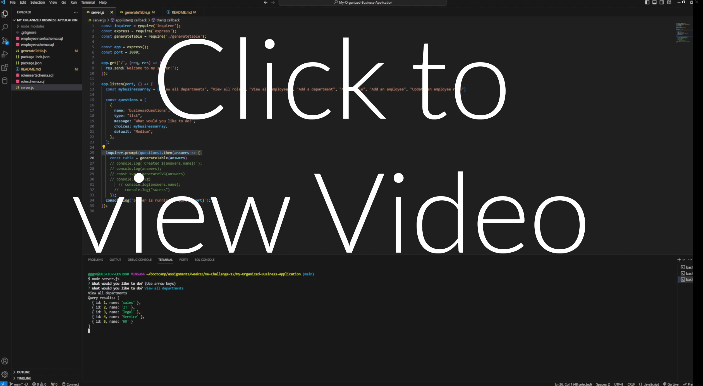

# My-Organized-Business-Application

## User Story

AS A student

I WANT to build a fully functional backend employee accounter

SO THAT my database can track and log, employees, managers and positions

## Acceptance Criteria

GIVEN a that the dateabase is fully functionable

WHEN I successfully installed my sql 2

WHEN I create a working prompts

WHEN I create a easy to use design

WHEN I have presented view all departments, view all roles, view all employees, add a department, add a role, add an employee, and update an employee role

When the user can add roles, employees and departments

## Walkthrough Video

